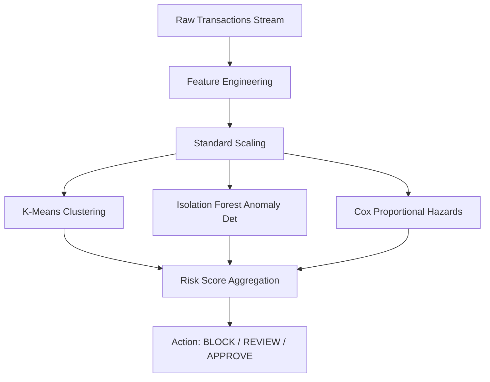

# PulseFlow: Real-Time Merchant Profiling & Risk Scoring Pipeline

PulseFlow is a machine learning-driven risk classification and survival pipeline designed to ingest transaction-level data, engineer merchant-level behavior profiles, cluster merchants based on trading cohorts, detect anomalous transaction patterns, and forecast merchant lifetime survival (churn risk). 

Rather than treating fraud detection as a purely transaction-level classification problem, this project aggregates transaction histories to build a continuous behavioral profile of each merchant (identified by the `card1` column) and computes an interactive, real-time risk score.

---

##  The Data

The pipeline runs on transaction-level datasets containing transaction amounts, product codes, card types, and transaction timing.

*   **Raw Data Source**: `train_transaction.csv` (~683 MB) and `test_transaction.csv` (~613 MB).
*   **Target Entities**: Merchants, identified by the card registration number/device ID in the `card1` column.
*   **Volume**: Over 590,000 transaction rows are processed, which maps to thousands of unique merchants.
*   **Label**: `isFraud` (Binary indicator representing whether a transaction was flagged as fraudulent).

### Data Filtering & Noise Reduction
A major challenge of merchant classification in transaction datasets is dealing with low-volume entities.

> Merchants with fewer than 5 transactions are filtered out. 
> 
> * **Why?** A merchant with 1 transaction that happens to be fraudulent has a 100% fraud rate, which is statistically meaningless and introduces massive variance. Filtering these out reduces noise while preserving the bulk of the transaction volume.
> * **Distribution**: 75% of merchants have 14 or fewer transactions. Filtering at $< 5$ transactions successfully eliminates statistical outliers while maintaining a high coverage rate of active, mature merchants.

---

##  Exploratory Data Analysis (EDA) Insights

Exploration of the raw dataset in `notebooks/explore.ipynb` revealed critical insights that shaped our feature selection and model architecture:

1.  **Product Category Fraud Signals**: 
    Transactions associated with `ProductCD = 'C'` (typically cash/sharing payments) exhibit a disproportionately high fraud rate of **~11.7%** compared to other product codes like `ProductCD = 'W'` (web/e-commerce).
2.  **Transaction Amount Differences**:
    The average ticket size for a fraudulent transaction is **$15 higher** than that of a non-fraudulent transaction, indicating that fraudsters target higher payouts on average.
3.  **Anonymized Identifiers**:
    Transactions registered under `anonymous.com` email domains correlate heavily with high-risk events, serving as a powerful categorical indicator of potential fraudulent activity.
4.  **Temporal Concentrations**:
    The transaction timestamp mean (`TransactionDT`) is significantly higher for fraudulent transactions, suggesting that fraud attempts are concentrated later in the transaction window.
5.  **Card Types**:
    Credit cards exhibit a higher propensity for fraud compared to debit cards, which warrants tracking the ratio of credit card transactions per merchant.

---

##  Feature Engineering

For each merchant, transaction logs are aggregated into the following **14 features** to construct a comprehensive behavioral profile:

| Feature Name | Type | Description |
| :--- | :--- | :--- |
| `total_gmv` | Financial | Cumulative gross merchandise volume (sum of all transaction amounts). |
| `avg_amount` | Financial | Mean transaction value. |
| `std_amount` | Financial | Standard deviation of transaction values (volatility measure). |
| `max_amount` | Financial | Maximum single transaction amount. |
| `min_amount` | Financial | Minimum single transaction amount. |
| `max_avg_ratio`| Ratios | Ratio of the maximum transaction amount to the average transaction amount. |
| `cv` | Volatility | Coefficient of Variation (`std_amount` / `avg_amount`), tracking consistency of ticket sizes. |
| `total_transactions` | Volume | Total transaction count. |
| `fraud_count` | Risk | Sum of transactions flagged as fraud. |
| `fraud_rate` | Risk | Ratio of fraudulent transactions to total transactions. |
| `pct_product_c` | Behavior | Percentage of transactions under product code `C`. |
| `pct_product_w` | Behavior | Percentage of transactions under product code `W`. |
| `avg_hour` | Temporal | Average hour of the day (0-23) the merchant is active. |
| `pct_credit` | Card | Percentage of transactions funded via credit cards. |
| `pct_night_txn` | Temporal | Percentage of transactions occurring during night hours (midnight to 6:00 AM). |

---

##  Machine Learning Modeling Pipeline

The core ML system consists of three distinct models that analyze different vectors of merchant risk.



### 1. Cohort Clustering (K-Means)
To group merchants into distinct commercial profiles, we utilize K-Means clustering on the scaled merchant features.
*   **Parameters Evaluated**: Tested number of clusters $k \in [2, 10]$ evaluating both Inertia (elbow method) and Silhouette Score.
*   **Selected Config**: $k = 4$ clusters was selected to optimize the silhouette score while ensuring interpretable merchant cohorts.
*   **Cluster Interpretations**:
    *   **Cluster 0: "Healthy"**: Low-risk merchants with stable transaction volume, low ticket variance, and near-zero fraud rates.
    *   **Cluster 1: "High Risk"**: Characterized by extremely high fraud rates, volatile ticket sizes, and transactions concentrated in risky product categories.
    *   **Cluster 2: "Premium / Medium Risk"**: High average ticket size (premium buyers) with moderate transaction frequency and low-to-moderate fraud rates.
    *   **Cluster 3: "Anomalous High Volume"**: Enterprise-level merchants processing massive transaction volumes with low relative fraud rates but distinct high-frequency timing.

### 2. Anomaly Detection (Isolation Forest)
To flag suspicious merchant behaviors that diverge from standard cohorts, an Isolation Forest model is applied.
*   **Methodology**: Isolation Forest isolates observations by randomly selecting a feature and then randomly selecting a split value between the maximum and minimum values of the selected feature.
*   **Hyperparameter Tuning**: Evaluated contamination rates at 3%, 5%, 7%, and 10%.
*   **Selected Config**: **5% contamination rate**. This configuration maximized the separation of fraud rates between normal and anomalous merchants:
    *   Normal merchants had an average fraud rate of ~1.2%.
    *   Anomalous merchants (the 5% tail) had a fraud rate exceeding **15%**.
*   **Outputs**: 
    *   `is_anomaly`: Binary flag (1 = anomalous, 0 = normal).
    *   `anomaly_score`: Raw score indicating the severity of abnormality (lower values represent stronger anomalies).

### 3. Survival Analysis (Cox Proportional Hazards)
Instead of predicting immediate churn, we model the merchant's operational lifespan using survival analysis. This estimates the probability that a merchant will remain active over time.
*   **Timeline Metrics**:
    *   **Duration ($T$)**: The time in days between the merchant's first and last recorded transactions: $`T = \frac{t_{\text{last}} - t_{\text{first}}}{86400}`$, where $`t_{\text{last}}`$ is the timestamp of the last recorded transaction, and $`t_{\text{first}}`$ is the timestamp of the first recorded transaction.
    *   **Event ($E$)**: A binary indicator representing merchant churn. A merchant is flagged as churned ($E = 1$) if their last transaction occurred before the final 5% window of the dataset duration (suggesting they went cold).
*   **Regularization Tuning**: Swept L2 penalty weights (penalizers) at 0.0, 0.1, 0.5, and 1.0.
*   **Selected Config**: **0.1 penalizer** to resolve convergence warnings caused by feature collinearity, resulting in a robust, generalizable Concordance Index.
*   **Outputs**: Survival probabilities calculated for specific time windows:
    *   `survival_30`: 30-day survival probability.
    *   `survival_60`: 60-day survival probability.
    *   `survival_90`: 90-day survival probability.

---

##  Classifying and Scoring New Merchants

A primary constraint of the production system is the ability to score a **brand new merchant** (with zero history) or update an existing merchant's classification **immediately** when a new transaction arrives, without re-running batch scripts on the entire transaction history.

### 1. Lazy State Initialization
When a new transaction arrives for a merchant ID (`card1`) that is not yet stored in the database:
1.  The pipeline initializes a blank rolling statistics schema.
2.  The transaction timestamp is set as both `first_txn` and `last_txn`.
3.  The transaction amount and metadata represent the baseline.

### 2. Incremental Feature Updates (The Math)
To avoid expensive database queries, merchant features are computed **incrementally** inside the transaction consumer. For each new transaction, the pipeline updates running aggregates:

*   **Count Update**: $`N \leftarrow N + 1`$, where $N$ is the total transaction count (`total_transactions`).
*   **Rolling Sum of Amounts** ($S$): $`S \leftarrow S + x`$, where $S$ is the rolling sum of transaction amounts (`sum_amounts`), and $x$ is the new transaction amount (`TransactionAmt`).
*   **Rolling Sum of Squares of Amounts** ($SS$): $`SS \leftarrow SS + x^2`$, where $SS$ is the rolling sum of squares of transaction amounts (`sum_sq_amounts`).
*   **Running Mean** ($\mu$): $`\mu = \frac{S}{N}`$, where $\mu$ is the average transaction amount (`avg_amount`).
*   **Running Standard Deviation** (calculated on-the-fly without history): $`\text{Var} = \frac{SS}{N} - \mu^2`$ and $`\sigma = \sqrt{\max(0, \text{Var})}`$, where $\sigma$ is the standard deviation (`std_amount`).
*   **Running Percentages** (e.g., Night Transaction Ratio $`P_{\text{night}}`$): $`P_{\text{night}} = \frac{C_{\text{night}}}{N}`$, where $`C_{\text{night}}`$ is the rolling count of transactions occurring at night (`night_transaction_count`), and $`P_{\text{night}}`$ is the ratio (`pct_night_txn`).

Using this mathematical formulation, updating features is an $O(1)$ operation, allowing real-time profiling.

### 3. Real-Time Inference
Once the updated vector $X$ is assembled:
1.  $X$ is scaled using the pre-trained `scaler.pkl`.
2.  The scaled vector is passed to the trained `kmeans.pkl` to determine the merchant cluster.
3.  The scaled vector is passed to `isolation_forest.pkl` to calculate `is_anomaly` and `anomaly_score`.
4.  The vector is passed to `cox_model.pkl` to predict survival function and compute the 90-day survival rate (`survival_90`).

### 4. Composite Risk Score & Recommendations
The system aggregates the three model vectors into a single, unified metric:

$$
\text{Risk Score} = (R_{\text{fraud}} \times 0.4) + (A_{\text{anomaly}} \times 0.3) + ((1 - S_{90}) \times 0.3)
$$

where:
*   $`R_{\text{fraud}}`$ is the merchant's historical fraud rate (`fraud_rate`).
*   $`A_{\text{anomaly}}`$ is the binary anomaly indicator (`is_anomaly`).
*   $`S_{90}`$ is the 90-day survival probability (`survival_90`).

Decisions are routed dynamically based on the composite score:

| Risk Score Range | Recommendation | Action Triggered |
| :--- | :--- | :--- |
| **Score $> 0.30$** |  **BLOCK** | Automated account suspension; hold funds. |
| **$0.15 <$ Score $\le 0.30$** |  **REVIEW** | Flag for manual compliance review; temporary velocity limits. |
| **Score $\le 0.15$** |  **APPROVE** | Seamless, unrestricted transaction clearance. |

---

##  Repository Structure (ML Files)
```
pulseflow/
├── data/                             # Raw and processed datasets
│   ├── merchant_features.csv         # Aggregated baseline merchant profiles
│   ├── merchant_scores_train.csv     # Scored training set (with clusters/survival probabilities)
│   ├── merchant_scores_test.csv      # Scored test set
│   └── train_transaction.csv         # Raw transactions source
├── models/                           # Trained ML artifacts (joblib format)
│   ├── scaler.pkl                    # StandardScaler weights
│   ├── kmeans.pkl                    # K-Means clustering model
│   ├── isolation_forest.pkl          # Isolation Forest anomaly model
│   └── cox_model.pkl                 # Cox Proportional Hazards survival model
├── notebooks/
│   └── explore.ipynb                 # Exploratory data analysis (EDA) and visualizations
├── src/                              # Core pipeline scripts
│   ├── features.py                   # Aggregates raw transactions to merchant features
│   ├── cluster.py                    # Trains K-Means cluster models
│   ├── anomaly.py                    # Trains Isolation Forest anomaly models
│   └── survival.py                   # Trains Cox survival models
└── services/
    └── consumer/
        └── consumer.py               # Streaming transaction scoring service (real-time inference)
```
